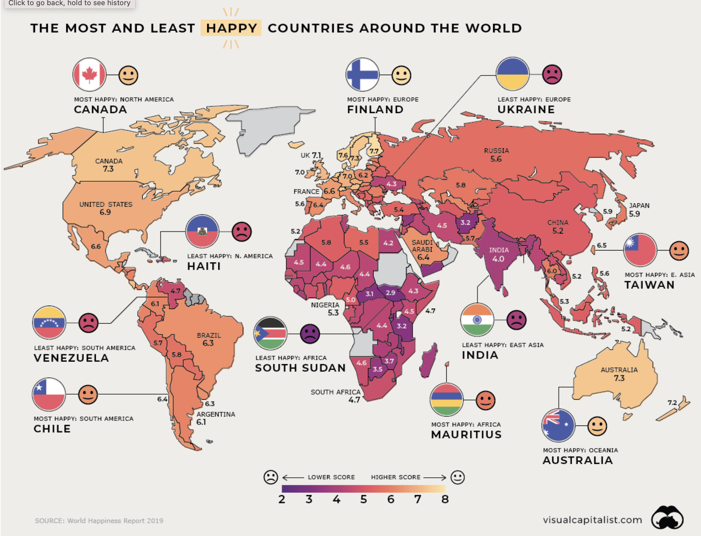

## **Central Question:**

Why does it seem like the nonreligious nations are more happy

## **Why this is important to me:**

Religion is supposed to bring happiness to people. It is the central reason people want to be religious. I understand that part of the reason is the after life but many prayers and sermons are spent on the happiness in this life.

If Christians are truly blessed then shouldn't they be more happy?

## **The most happy countries are the least religious**

And the saddest countries are the most religious. Every country with greater than 7.0 happiness are the least religious countries.

[Russia](https://en.wikipedia.org/wiki/Religion_in_Russia) and[ China](https://en.wikipedia.org/wiki/Religion_in_China) are obvious exceptions but their non-religious nature is due to national mandates and authoritarian rule.

So any country with the freedom to choose religion meets this fact.

As I look at these, I wonder if I can argue that the most religious countries are the least happy. This would be completely opposite of what religious people would expect by their teachings

[https://www.visualcapitalist.com/visualizing-the-happiest-country-on-every-continent/](https://www.visualcapitalist.com/visualizing-the-happiest-country-on-every-continent/)

[https://www.pewforum.org/2018/06/13/how-religious-commitment-varies-by-country-among-people-of-all-ages/](https://www.pewforum.org/2018/06/13/how-religious-commitment-varies-by-country-among-people-of-all-ages/)

# Letter Sections
- [Letter](https://letter-to-christian-scholars.github.io/Letter-to-Christian-Scholars/index.html)
- [Preface: Belief Change Bias](https://letter-to-christian-scholars.github.io/Letter-to-Christian-Scholars/preface.html)
- Abuse And Oppression
  * [Brutality In Gods Name](https://letter-to-christian-scholars.github.io/Letter-to-Christian-Scholars/Brutality-In-Gods-Name.html)
  * [Christianity the Religion of your Oppression](https://letter-to-christian-scholars.github.io/Letter-to-Christian-Scholars/Christianity-The-Religion-Of-Your-Oppression.html)
  * [Rapture Anxiety](https://letter-to-christian-scholars.github.io/Letter-to-Christian-Scholars/Rapture-Anxiety.html)
  * [Sexual Abuse Epidemic and Cover-Ups](https://letter-to-christian-scholars.github.io/Letter-to-Christian-Scholars/Sexual-Abuse-Epidemic-And-Cover-Ups.html)
  * [Slavery Justification via Bible](https://letter-to-christian-scholars.github.io/Letter-to-Christian-Scholars/Slavery-Justification-Via-Bible.html)
- Bible Accuracy
  * [1st Person Accounts of Jesus](https://letter-to-christian-scholars.github.io/Letter-to-Christian-Scholars/1st-Person-Accounts-Of-Jesus.html)
  * [1st Person Old Testament](https://letter-to-christian-scholars.github.io/Letter-to-Christian-Scholars/1st-Person-Old-Testament.html)
  * [Biblical History and Science](https://letter-to-christian-scholars.github.io/Letter-to-Christian-Scholars/Biblical-History-And-Science.html)
  * [Josephus and Jesus](https://letter-to-christian-scholars.github.io/Letter-to-Christian-Scholars/Josephus-And-Jesus.html)
  * [Nicene Creed](https://letter-to-christian-scholars.github.io/Letter-to-Christian-Scholars/Nicene-Creed.html)
  * [New Testament Contradictions](https://letter-to-christian-scholars.github.io/Letter-to-Christian-Scholars/New-Testament-Contradictions.html)
- Trust In God
  * [Evils of Unchecked Dogma](https://letter-to-christian-scholars.github.io/Letter-to-Christian-Scholars/Evils-Of-Unchecked-Dogma.html)
  * [Grooming and Conditioning](https://letter-to-christian-scholars.github.io/Letter-to-Christian-Scholars/Grooming-And-Conditioning-In-Christianity.html)
  * [Happiness and Religion](https://letter-to-christian-scholars.github.io/Letter-to-Christian-Scholars/Happiness-And-Religion.html)
  * [Miracles and Big Data](https://letter-to-christian-scholars.github.io/Letter-to-Christian-Scholars/Miracles-And-Big-Data.html)
  * [Morals and God](https://letter-to-christian-scholars.github.io/Letter-to-Christian-Scholars/Morals-And-God.html)
  * [Spirit](https://letter-to-christian-scholars.github.io/Letter-to-Christian-Scholars/Spirit.html)
